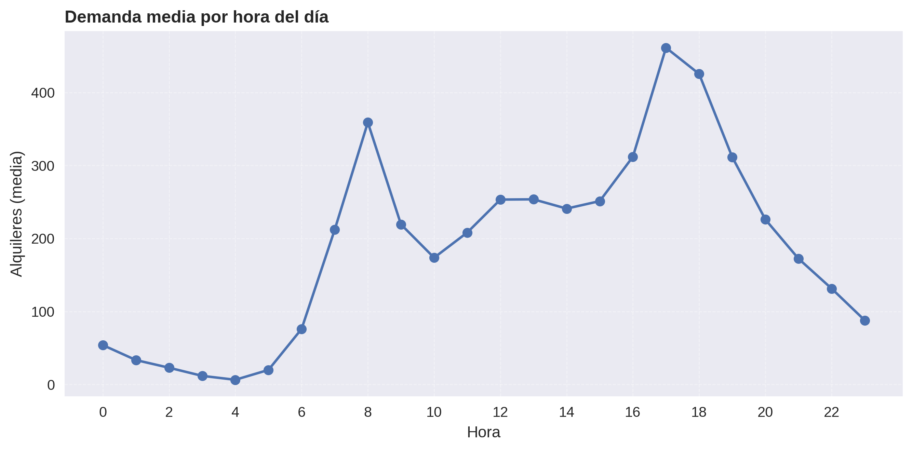
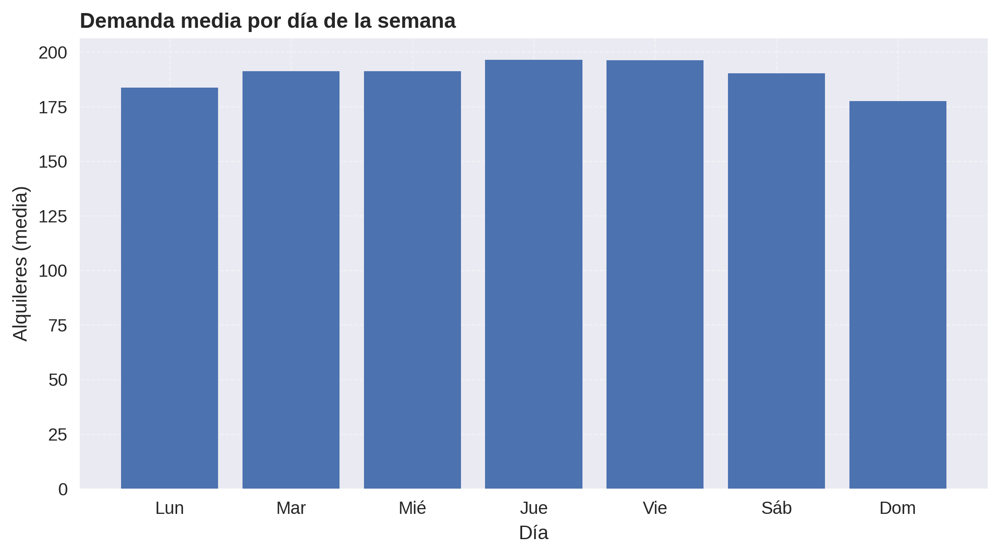
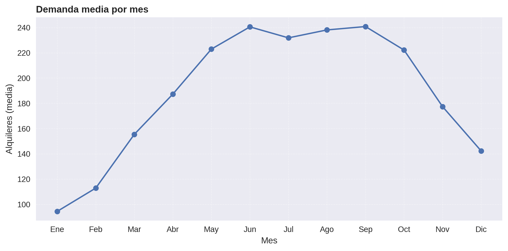
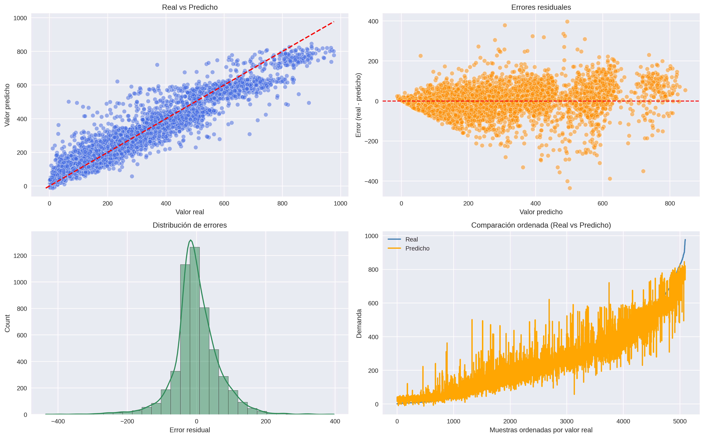

# Predicción de alquiler de bicicletas con Machine Learning

## Descripción
Este proyecto aplica técnicas de aprendizaje automático para predecir la demanda de bicicletas compartidas en función de variables temporales y meteorológicas, utilizando el dataset **Bike Sharing Dataset (UCI Machine Learning Repository)**.  
El objetivo es desarrollar y comparar distintos modelos de regresión, seleccionando aquel que ofrezca el mejor desempeño en términos de error de predicción y capacidad de generalización.

---

## Dataset
- Fuente: [UCI Bike Sharing Dataset](https://archive.ics.uci.edu/ml/datasets/bike+sharing+dataset)  
- Periodo: 2011–2012  
- Frecuencia: registros **horarios** de alquileres de bicicletas en Washington D.C.  
- Variables disponibles:
  - Temporales: año, mes, día de la semana, hora, estacionalidad, festivos, fines de semana.
  - Meteorológicas: temperatura, sensación térmica, humedad, velocidad del viento.
  - Etiqueta objetivo: número de bicicletas alquiladas por hora.

---

## Objetivos
1. **Explorar y preprocesar** los datos para generar variables temporales y climáticas derivadas.  
2. **Entrenar múltiples modelos de Machine Learning** y seleccionar el más competitivo mediante validación cruzada.  
3. **Evaluar el modelo final** en un conjunto de test independiente, utilizando métricas de error y representaciones gráficas.  
4. **Visualizar patrones de uso** de bicicletas por hora, día de la semana y mes.  

---

## Flujo de trabajo
1. **Preprocesamiento y feature engineering**  
   - Conversión de fechas y horas.  
   - Creación de variables temporales (día de la semana, fines de semana, horas pico).  
   - Desnormalización de variables meteorológicas.  
   - One-hot encoding para estacionalidad y condiciones climáticas.  

2. **Entrenamiento de modelos**  
   Se entrenaron y compararon varios algoritmos de regresión:
   - XGBoost  
   - HistGradientBoosting  
   - LightGBM  
   - ExtraTrees  
   - Random Forest  
   - SVR  
   - KNN  
   - ElasticNet  
   - Ridge  
   - Lasso  

   Los resultados de validación cruzada (RMSE CV) muestran que los modelos basados en boosting fueron los más competitivos:  

   | Modelo               | RMSE CV |
   |----------------------|---------|
   | XGBoost              | 62.13   |
   | HistGradientBoosting | 62.43   |
   | LightGBM             | 63.78   |
   | ExtraTrees           | 65.77   |
   | Random Forest        | 72.77   |
   | SVR                  | 75.26   |
   | KNN                  | 83.08   |
   | ElasticNet           | 95.92   |
   | Ridge                | 96.04   |
   | Lasso                | 96.05   |

3. **Evaluación del modelo final**  
   El modelo seleccionado fue **XGBoost**, que obtuvo un **R² ≈ 0.91** y un **RMSE ≈ 65.7** en el conjunto de test, lo que refleja una buena capacidad de generalización.  

---

## Resultados

### Distribuciones de la demanda
Patrones medios de alquiler de bicicletas en distintas dimensiones temporales:  

- **Por hora del día**  
    

- **Por día de la semana**  
    

- **Por mes**  
    

### Evaluación del modelo
Visualización del desempeño del modelo final:  

- **Gráficos de evaluación** (Real vs Predicho, Residuos y Distribución de errores)  
    

